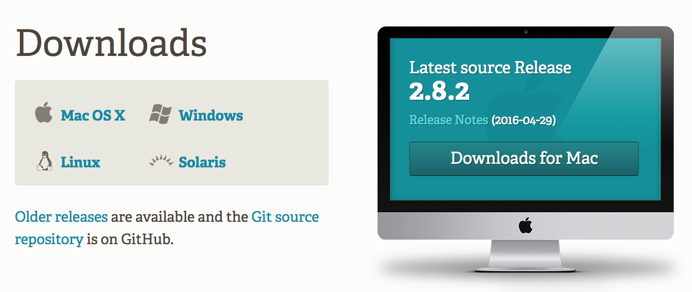
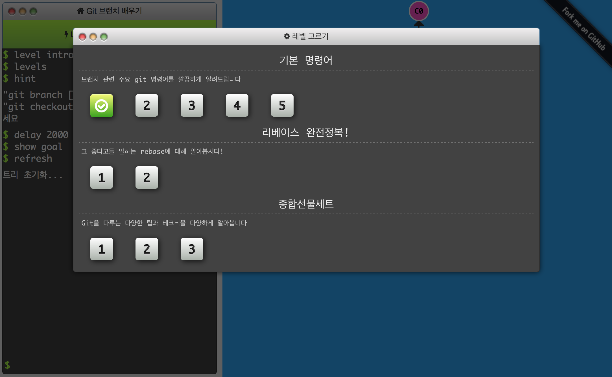

class: center, middle


## Kickstart
http://hatemogi.github.io/git-kickstart/
---

# 김대현

* 프리랜서 서버 개발자
* Daum 카페, 캘린더, 마이피플 개발
* __사내 Git 저장소 시스템 구축 & 운영__
* Clojure, Ruby, Java
* 한국 개발자를 위한 플랫폼 구축에 관심

.footnote[
[Medium](https://medium.com/@hatemogi)
[Twitter](https://twitter.com/hatemogi)
[GitHub](https://github.com/hatemogi)
[개인홈](https://hatemogi.com)
]
---

# 대상

* 버전 관리를 아직 안하는 개발자
* Git에 관심은 있지만, 아직 기회가 닿지 않은 분

---
# Git 사용시 이득

.full-width[]
개인/팀 개발 생산성 대폭 향상
---

# 목표 - Kickstart

.full-width[[](https://youtu.be/olBM1U5bO7Y?t=8s)]
버전관리 & Git 사용 설득

---

# 차례

1. (Git으로) 버전 관리를 해야하는 이유
1. Git 개념 파악
1. CLI로 명령어 실습
1. 시각화 도구로 복습
---

class: center, middle, inverse

# __기__ 승 전 결

개인 경험 이야기

---

# 2000년 - 버전관리 LV.0

* 물류 IT 회사
* 전자문서 중계 클라이언트/서버
* __대형 고객사 ← 클라이언트 프로그램을 대신 개발해서 설치해 줌__
* 같은 일을 하는 클라이언트 프로그램 OO개

## 버전을 관리하는 방법
```bash
tar -cvzf [백업파일-날짜.tgz] [소스DIR]
cp -R [소스DIR] [적당한-새이름]
```

---
# 2004년 - 버전관리 LV.2

* Daum 카페 개발팀 입사
* 개발팀만 10+명
* CVS([Concurrent Versions System](https://en.wikipedia.org/wiki/Concurrent_Versions_System)) 사용

## 기대 효과

* 개발자간 소스코드 동기화 (sync)
* 서비스 배포시 tag달기
* 누가 이 코드를 짠 건지 확인

> 거봐요, 당신이 커밋한 거잖아!

---

# 2008년 - 버전관리 LV.3

* Daum 캘린더 개발 TFT
* 사내 표준 VCS 시스템 - Subversion (SVN)
* SVN - CVS의 단점을 극복
  * atomic 커밋: 모 아님 도
  * 파일명 변경 추적
* 중앙집중 SVN 서버 → 수백 명이 접근
* SVN에서 브랜치 → 쓰면 안 되는 거.

.footnote[[다음 캘린더 서비스 개발 비하인드 스토리](https://medium.com/happyprogrammer-in-jeju/다음-캘린더-서비스의-비하인드-스토리-ec0faac67f05)]
---

# 2012년 - 버전관리 LV.4

* 사내 Git 저장소 시스템 구축
* Git을 쓰니 비로소 브랜치를 쓸 수 있게 됨
* 배포 / 개발 / 핫픽스 / UI 브랜치 병행 가능
* 분산 버전 관리 → 로컬에서 빠르게 할 수 있는 일 다양

.footnote[[사내 Git 저장소 개발사례](http://www.slideshare.net/hatemogi/devon2013-git)]

---

# 2016년

.center[[](https://en.wikipedia.org/wiki/Early_adopter>)]

* Quiz: 우리의 위치는?

---
# 요약 - Git을 알아야 하는 이유

* 소스코드
  * 잃어 버리면 안된다 → 백업
  * 계속 바뀐다 → 이력 추척
  * 여럿이서 바꾼다 → 누가 뭘 왜 바꿨나?

* Git이 좋은 점
  * 강력하고 편리한 브랜치
  * 빠른 성능
  * 분산 저장소

---
class: center, middle, inverse

# 기 __승__ 전 결

핵심 개념 공략

---

# Git이 참 훌륭한데...

* 숙지할 개념이 있습니다.
* Subversion과도 다릅니다.
* __한마디로 조금 노력이 필요합니다.__
* 걱정금지: 그래봐야 별 거 아닙니다.

---

background-image: url("img/begin-root.jpg")

---

background-image: url("img/distributed.png")

# 특징(1)
### DVCS

---

# 특징(2) - 차이점 or 스냅샷 기록

.full-width[]
.center[각 파일에 대한 변화를 저장하는 시스템]

---

# 특징(2) - 차이점 or 스냅샷 기록

.full-width[]
.center[시간순으로 프로젝트의 스냅샷을 저장]

---

# 특징(3) - 세 가지 상태 공간

.full-width[]

---

class: center, middle

## Git 핵심 개념 공략

---

# 커밋과 트리 <small>commit & tree</small>

.full-width[]

---

# 커밋과 부모들 <small>commits & parents</small>

.full-width[]

* 커밋은 트리로 하나의 스냅샷을 참조
* 부모 커밋을 참조해서 커밋 히스토리 추적
---

# 브랜치 <small>branch</small>

.half-width[
* 커밋을 참조하는 포인터
* 커밋이 추가될 때, 따라서 이동.
* 기본은 `master` 브랜치
* `HEAD`는 현재 브랜치 포인터

## 활용예

* 작업별: 배포 / 개발 / 핫픽스 / ...
* 대상별: 고객사(A) / 고객사(B) / ...
]

.half-width[
.full-width[]
]

---

background-image: url("img/foundation.jpg")

---

class: center, middle, inverse

# 기 승 __전__ 결

실습 해보잣!

---

# 기본 실습 순서

1. 설치 & 설정
1. 기본 명령어
1. 리모트 저장소 활용
1. 브랜치 활용
1. 고급 명령어

---

class: center, middle

## 설치 & 설정

---

.full-width[
[](https://https://git-scm.com/downloads)
]

.half-width[
## Linux
> apt-get install git
]

.half-width[
## Windows 설치 후

> C:\Program Files\Git

]
---

# 최초 설정

```bash
git config --global user.name "홍길동"
git config --global user.email "gd.hong@mail.com"
```

```bash
git config --global color.ui true
git config --global push.default simple
```

```bash
git config --global core.quotepath false
```

```bash
git config --global core.precomposeunicode true
git config --global credential.helper osxkeychain
```

```bash
git config --list
```
---

class: center, middle

## 기본 실습

---

# 실습(1) - 저장소 생성

1. 기존 디렉터리에서 만들기
```bash
$ git init
```
```bash
$ git add README.md
$ git commit -m "최초 커밋"
```

1. 리모트 저장소에서 복제하기
```bash
$ git clone https://github.com/hatemogi/git-kickstart
Cloning into 'git-kickstart'...
remote: Counting objects: 74, done.
remote: Compressing objects: 100% (65/65), done.
remote: Total 74 (delta 30), reused 53 (delta 9), pack-reused 0
Unpacking objects: 100% (74/74), done.
Checking connectivity... done.
```

---

# 실습(2) - 변경 기록하기

```bash
$ git status
On branch master
Your branch is up-to-date with 'origin/master'.
nothing to commit, working directory clean
```

.full-width[]

---

```bash
$ echo "new awesome code" > main.txt
```
```bash
$ git status
On branch master
Your branch is up-to-date with 'origin/master'.
Untracked files:
  (use "git add <file>..." to include in what will be committed)

	main.txt

nothing added to commit but untracked files present (use "git add" to track)
```

.full-width[]

---

```bash
$ git add main.txt
```
```bash
$ git status
On branch master
Your branch is up-to-date with 'origin/master'.
Changes to be committed:
  (use "git reset HEAD <file>..." to unstage)

	new file:   main.txt
```

.full-width[]

---

## 첫번째 커밋

```bash
$ git commit -m "main.txt 추가"
[master 92cea98] main.txt 추가
 1 file changed, 1 insertion(+)
 create mode 100644 main.txt

```


.full-width[]

---
## 커밋 이력 보기

```bash
$ git log
commit 92cea987662afe5c6b0467440b0206480181ff5a
Author: Daehyun Kim <hatemogi@gmail.com>
Date:   Mon May 2 23:42:10 2016 +0900

    main.txt 추가

commit 5eda0b9c3a5ce8701c11d4de5e03e04834f6d778
Author: Daehyun Kim <hatemogi@gmail.com>
Date:   Mon May 2 23:40:43 2016 +0900

    열혈 업데이트

commit 095335e14cb4c8952659c408322771176d961b98
Author: Daehyun Kim <hatemogi@gmail.com>
Date:   Mon May 2 22:20:01 2016 +0900

    로컬 웹서버 필요 없다
```

---
# 실습(2) - 요약

* [git clone] - 리모트 저장소 복제
* [git status] - 로컬 저장소 상태 확인
* [git add] - 새 파일 등록(추적)
* [git commit] - 변경 내용 커밋
* [git log] - 커밋 이력 확인

---

# 실습(3) <small>차이점 확인하며 커밋</small>

```bash
$ echo "the next line" >> main.txt
```
```bash
$ git status
On branch master
Your branch is ahead of 'origin/master' by 1 commit.
  (use "git push" to publish your local commits)
Changes not staged for commit:
  (use "git add <file>..." to update what will be committed)
  (use "git checkout -- <file>..." to discard changes in working directory)

	modified:   main.txt

no changes added to commit (use "git add" and/or "git commit -a")
```

---

## 차이점 확인

```bash
$ git diff
diff --git a/main.txt b/main.txt
index a7c6f28..9c8904a 100644
--- a/main.txt
+++ b/main.txt
@@ -1 +1,2 @@
 new awesome code
+the next line
```

```bash
$ git commit -am "add 3rd line"
```

---
## 커밋 로그 재작성

```bash
$ git commit --amend -am "add 2nd line"
```

---

## 커밋 이력 보기 -p

```bash
$ git log -p
commit 7ba9d11890531adeb256a34329a0214c06f22348
Author: Daehyun Kim <hatemogi@gmail.com>
Date:   Tue May 3 00:58:52 2016 +0900

    add 2nd line

diff --git a/main.txt b/main.txt
index a7c6f28..9c8904a 100644
```

---

## 커밋 리셋

```bash
$ git reset HEAD^^
```

```bash
$ git status
On branch master
Your branch is up-to-date with 'origin/master'.
Untracked files:
  (use "git add <file>..." to include in what will be committed)

	main.txt

nothing added to commit but untracked files present (use "git add" to track)
```

---
# 실습(3) - 요약

* [git diff] - HEAD와 차이 비교
* [git commit -am][git commit] - 스테이지 커지지 않고 바로 커밋
* [git commit --amend][git commit] - 커밋 재작성
* [git log -p][git log] - 커밋 이력을 차이점과 함께 확인
* [git reset HEAD^^][git reset] - 이전 이전 커밋으로 리셋

---

class: center, middle

## 리모트 저장소 활용

---

# 중앙집중 저장소

.full-width[[](https://git-scm.com/book/en/v2/Distributed-Git-Distributed-Workflows)]
---

# 실습(4) - 리모트 저장소

* 리모트에서 가져오기
```bash
$ git pull
```

* 리모트에 보내기
```bash
$ git push
```

---

class: center, middle

## 브랜치 작업

---

## 실습(5) - 브랜치 만들기

```bash
$ git branch testing
```

.full-width[]

---

## 실습(5) - 브랜치 이동

```bash
$ git checkout testing
```

.full-width[]

---

## 실습(5) - `testing`에서 커밋

```bash
$ vim test.rb
$ git commit -a -m 'made a change'
```

.full-width[]

---

## 실습(5) - 다시 `master`로 이동

```bash
$ git checkout master
```

.full-width[]

---

## 실습(5) - `master`에서 커밋

```bash
$ vim test.rb
$ git commit -a -m 'made other changes'
```

.full-width[]

---

# 실습(5) - 요약

* [git branch] - 브랜치 만들기
* [git checkout] - 브랜치 이동하기

---

class: center, middle

## 브랜치 병합
merge / rebase

---

## 실습(6) - 브랜치 merge

```bash
$ git checkout master
$ git merge testing
```

.full-width[]

---

## 실습(6) - merge 커밋

.full-width[]

---

# 실습(6) - 요약

* [git merge] - 브랜치 병합
* [git rebase] - 브랜치 리베이스

---

## 흔한 브랜치 모델

.full-width[]

---

class: center, middle

## 고급 명령어

---
## 고급 명령어

* [git rebase -i][git rebase]
* [git stash]
* [git reflog]
* [git submodule]

---

class: center, middle

## 시각화 도구 실습

---
# 시각화 도구 실습

.full-width[[](http://learnbranch.urigit.com)]

---

# 참고: D3 시각화

* [Git w/D3](https://onlywei.github.io/explain-git-with-d3/)
* [Git w/D3 zen](https://onlywei.github.io/explain-git-with-d3/#zen)


---
class: center, middle, inverse

# 기 승 전 __결__

더 잘 쓰려면?

---
## 무료 GUI 클라이언트

* [GitHub Desktop: Simple collaboration from your desktop](https://desktop.github.com)
* [SourceTree: A free Git & Mercurial client for Windows or Mac](https://www.sourcetreeapp.com)
* [GitKraken: The downright luxurious Git client, for Windows, Mac & Linux](https://www.gitkraken.com)

## 무료 TUI(?) 클라이언트

* [Tig: Text-mode interface for git](https://github.com/jonas/tig)

---
## IDE 플러그인

* IntelliJ, Eclipse, XCode, Android Studio, Visual Studio

## Text Editor 플러그인

* Sublime Text, Atom, Emacs, Vim

## 도서

* [프로 Git 2판: 그림으로 이해하는 Git의 작동 원리와 사용법](http://www.aladin.co.kr/shop/wproduct.aspx?ItemId=79232604)
* [소셜 코딩으로 이끄는 GitHub 실천 기술](http://www.aladin.co.kr/shop/wproduct.aspx?ItemId=51796592)

---

background-image: url("img/gitflow.gif")

[Git Flow](https://github.com/nvie/gitflow)


---

# 참고 자료

.half-width[
## 한국어
* [git - 간편 안내서](http://rogerdudler.github.io/git-guide/index.ko.html)
* [A Visual Git Reference](https://marklodato.github.io/visual-git-guide/index-ko.html)
* [[NDC16] Effective Git](http://www.slideshare.net/kexplo/ndc2016-effective-git)
* [Pro Git 2판](https://git-scm.com/book/ko/v2)
* [생활코딩 GIT](https://opentutorials.org/course/1492)
* [Git 브랜치 배우기](http://learnbranch.urigit.com)
* [git-flow cheatsheet](http://danielkummer.github.io/git-flow-cheatsheet/index.ko_KR.html)
]

.half-width[
## English

* [Try Git](http://try.github.io/)
* [Visualiing Git Concepts with D3](https://onlywei.github.io/explain-git-with-d3/)
* [GitHub Cheatsheet (PDF)](https://training.github.com/kit/downloads/github-git-cheat-sheet.pdf)
* [Visual Git Cheatsheet](http://ndpsoftware.com/git-cheatsheet.html)
]
---
class: center, middle, inverse

# 감사합니다

> [강의 평가 설문 참여하기](http://goo.gl/forms/aJAEP6cpmr)

[git init]: https://git-scm.com/docs/git-init
[git clone]: https://git-scm.com/docs/git-clone
[git status]: https://git-scm.com/docs/git-status
[git add]: https://git-scm.com/docs/git-add
[git commit]: https://git-scm.com/docs/git-commit
[git diff]: https://git-scm.com/docs/git-diff
[git reset]: https://git-scm.com/docs/git-reset
[git log]: https://git-scm.com/docs/git-log
[git reflog]: https://git-scm.com/docs/git-reflog
[git rebase]: https://git-scm.com/docs/git-rebase
[git stash]: https://git-scm.com/docs/git-stash
[git submodule]: https://git-scm.com/docs/git-submodule
[git branch]: https://git-scm.com/docs/git-branch
[git checkout]: https://git-scm.com/docs/git-checkout
